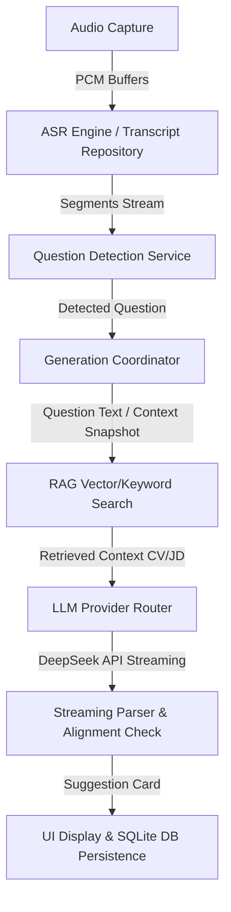

# AppState Modularization Architecture

This document describes the modular architecture of `AppState` after the Phase 1 refactoring passes.

## 1. Extracted Files & Component Map

The core `AppState` class has been modularized by extracting self-contained domains into extension files:

* **[AppState.swift](file:///Users/delaynomore/Library/CloudStorage/GoogleDrive-langcheng.cn@gmail.com/My%20Drive/ai_interview/Sources/InterviewCopilotMac/AppState.swift):** Contains the root composition, `@Published` UI properties, dependency injections, initialization, and lifecycle triggers.
* **[AppState+Actions.swift](file:///Users/delaynomore/Library/CloudStorage/GoogleDrive-langcheng.cn@gmail.com/My%20Drive/ai_interview/Sources/InterviewCopilotMac/AppState+Actions.swift):** Standardized action loading states and active user feedback notifications.
* **[AppState+Diagnostics.swift](file:///Users/delaynomore/Library/CloudStorage/GoogleDrive-langcheng.cn@gmail.com/My%20Drive/ai_interview/Sources/InterviewCopilotMac/AppState+Diagnostics.swift):** Heartbeat monitoring, SQLite/RAG/Provider active operations markers, and diagnostic/capture events logging.
* **[AppState+Permissions.swift](file:///Users/delaynomore/Library/CloudStorage/GoogleDrive-langcheng.cn@gmail.com/My%20Drive/ai_interview/Sources/InterviewCopilotMac/AppState+Permissions.swift):** Operating system permissions requesting (microphone, speech recognition, screen capture) and permissions verification probe logic.
* **[AppState+Documents.swift](file:///Users/delaynomore/Library/CloudStorage/GoogleDrive-langcheng.cn@gmail.com/My%20Drive/ai_interview/Sources/InterviewCopilotMac/AppState+Documents.swift):** User resume (CV) and job description (JD) document saving, cleaning, and indexing.
* **[AppState+Sessions.swift](file:///Users/delaynomore/Library/CloudStorage/GoogleDrive-langcheng.cn@gmail.com/My%20Drive/ai_interview/Sources/InterviewCopilotMac/AppState+Sessions.swift):** Loading, deleting, exporting, and clearing local database session state, floating assistant visibility, and error display helper utilities.
* **[AppState+Providers.swift](file:///Users/delaynomore/Library/CloudStorage/GoogleDrive-langcheng.cn@gmail.com/My%20Drive/ai_interview/Sources/InterviewCopilotMac/AppState+Providers.swift):** Keychain-backed API keys storage (both LLM providers and embeddings providers), provider test connectivity, and fallback routing.
* **[AppSection.swift](file:///Users/delaynomore/Library/CloudStorage/GoogleDrive-langcheng.cn@gmail.com/My%20Drive/ai_interview/Sources/InterviewCopilotMac/AppSection.swift):** The global section enum representing view routing (Home, Documents, Sessions, Readiness Check, Settings, Diagnostics).
* **[GenerationHelpers.swift](file:///Users/delaynomore/Library/CloudStorage/GoogleDrive-langcheng.cn@gmail.com/My%20Drive/ai_interview/Sources/InterviewCopilotMac/GenerationHelpers.swift):** Helper synchronization primitive (`StageBTrigger`) and delay protocols (`DelayProvider`, `RealDelayProvider`) for streaming watchdogs.

---

## 2. Remaining AppState Responsibilities

The root `AppState.swift` file is responsible for:
1. **State Composition:** Holding all `@Published` properties representing the active UI states.
2. **ASR Ingestion & Processing:** Segment consumption and processing candidates/interviewers speaking.
3. **Pipeline Coordination:** Orchestrating automatic question detection and invoking LLM providers to generate suggestion cards.
4. **Core Suggestion Generation:** Hosting the `generateSuggestion()` pipeline method and watchdogs.
5. **RAG Orchestration:** Coordinating embeddings rebuilding and hybrid retrieval.
6. **Audio Input/Signal Lifecycle:** Direct start/stop capture commands.

---

## 3. Main Pipeline Data Flow

The core system pipeline flows sequentially through the following stages:

1. **Audio Capture:** Reads system audio (interviewer) and microphone (candidate) using ScreenCaptureKit and AVFoundation.
2. **ASR Engine:** Transcribes streams into `TranscriptSegment` structs and saves them asynchronously to SQLite database.
3. **Question Detection:** Checks interviewer utterances against question heuristics and trigger rules.
4. **Generation Snapshot:** Halts old generations and captures clean recent transcript context.
5. **RAG Retrieval:** Pulls most relevant CV/JD chunks via vector cosine similarity and clean keyword matching.
6. **DeepSeek API:** Sends prompt containing the question, retrieved context, and transcript history to DeepSeek APIs.
7. **Suggestion Alignment:** Checks incoming streaming tokens and parses them into structured answer cards.
8. **UI/DB Persistence:** Renders the suggestion card in the Floating Panel and saves the snapshot in SQLite.

---

## 4. MainActor Rules & Concurrency

* **Class Isolation:** The entire `AppState` class is decorated with `@MainActor`. All fields and extension methods are isolated to the main thread automatically.
* **UI Updates:** All mutations of `@Published` properties must happen on the `@MainActor`.
* **Async Work:** Network calls (LLM/embedding requests) and file/database persistence run in cooperative detached background tasks (`Task.detached(priority: .utility)`) to keep the main thread fully responsive.
* **Hop-backs:** Use `await MainActor.run { ... }` or Swift concurrency main actor hops to safely publish state modifications from background threads.

---

## 5. Architectural Invariants

To keep the application correct, the following invariants must never be broken:

* **System Audio Only must not require microphone:** System audio capture using ScreenCaptureKit must be able to run independently without prompting the user for or requiring access to the physical microphone.
* **Transcript question must produce answer or visible error:** Any question identified by the transcript must cause the UI to transition to a loading state and produce either a structured suggestion card or transition to a visible error state (e.g. timeout / connectivity error).
* **Multi-question ASR transcript must be split:** High-volume or rapid-dialogue segments containing multiple questions must be segmented correctly so that the latest question supersedes older ones.
* **Current prompt primary question must equal active detected question:** The context built for the LLM prompt and the active card rendered on the floating UI must align to prevent answering stale questions.
* **Old generation must not overwrite new question:** In-flight tasks from previous questions must be cancelled immediately when a new question is detected. Late streaming responses from older questions must be rejected.
* **No Ollama dependency:** The application must only rely on configured HTTP cloud LLMs and local keyword search, with no hard dependency on local Ollama services.
* **No raw API keys shown:** Keychain keys must never be logged or displayed raw in the UI. Keys must always be masked using `maskKey` before presentation or diagnostic printouts.
* **dist app must rebuild after changes:** The code signature must always be verified by running the `./script/build_and_run.sh --verify` task after major source files changes.
